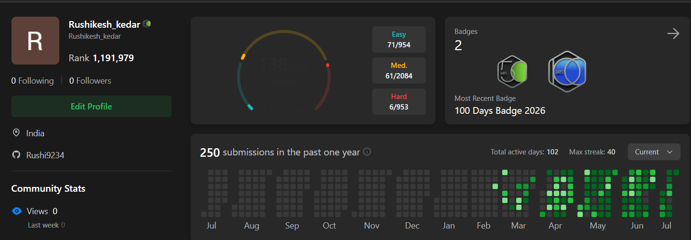

<!--
  ═══════════════════════════════════════════════════════════════════
   GitHub Profile README · Rushi9234 · Rushikesh Baban Kedar
   Structure inspired by @imjayeshjadhav, adapted to AI/ML + DS focus.
  ═══════════════════════════════════════════════════════════════════
  RELIABILITY NOTES:
   · Divider GIFs use github user-images (stable, widely used).
   · Stats / streak / LeetCode cards use public servers that CAN
     rate-limit. If any shows blank, see SETUP_GUIDE.md (Actions method).
   · EDIT markers show what to personalize before pushing.
-->

<!-- ═══════════════════ HERO ═══════════════════ -->
<div align="center">


<a href="https://git.io/typing-svg">
  
</a>

<br/>


</div>

<!-- ═══════════════════ ABOUT ═══════════════════ -->
##  About Me


**Final-year Computer Science & Engineering** student at **MIT Academy of Engineering, Pune** (CGPA: 7.52), building intelligent systems that solve real-world problems across **AI/ML, Data Science, and Generative AI**.

**National Finalist at Insightfy 6.0, IIM Lucknow** — ranked **1st nationally** in the Data Analysis round and **2nd nationally** in the Case Study round. I like turning messy data and open-ended problems into shipped, explainable products.

**🎯 Core Expertise**
- 🤖 **GenAI & Agents** — RAG pipelines, LangGraph state machines, LLM apps
- 📊 **Data Science** — EDA, forecasting, statistical modeling & storytelling
- 🧠 **Machine Learning** — gradient boosting, computer vision, explainability (SHAP)
- ⚡ **Backend & APIs** — FastAPI / Flask services powering ML systems
- 🌐 **Full-stack delivery** — React / Next.js frontends for AI products

<br clear="right"/>


<!-- ═══════════════════ TECH STACK ═══════════════════ -->
##  Technical Arsenal

<div align="center">

</div>

<table>
<tr>
<td valign="top" width="50%">

**AI / ML / GenAI**

```python
ai_stack = {
    "frameworks": ["PyTorch", "TensorFlow",
                   "Scikit-learn", "XGBoost"],
    "genai":      ["LangChain", "LangGraph",
                   "RAG", "FAISS", "Transformers"],
    "cv_nlp":     ["ViT", "GPT-2", "YOLOv8"],
    "explain":    ["SHAP", "SMOTE"],
}
```

</td>
<td valign="top" width="50%">

**Languages & Data**

```python
languages = ["Python", "SQL", "Java", "C++", "JavaScript"]

data_tools = {
    "wrangling": ["Pandas", "NumPy"],
    "viz":       ["Matplotlib", "Plotly", "Power BI"],
    "notebooks": ["Jupyter", "Google Colab"],
}
```

</td>
</tr>
<tr>
<td valign="top" width="50%">

**Backend & Web**

```javascript
const backend = {
  apis:      ["FastAPI", "Flask"],
  frontend:  ["React", "Next.js"],
  databases: ["MongoDB", "MySQL"],
};
```

</td>
<td valign="top" width="50%">

**Tools & Platforms**

```yaml
tools:
  version_control: [Git, GitHub]
  containers:      [Docker]
  cloud:           [AWS]
  ide:             [VS Code]
```

</td>
</tr>
</table>

**Tech Visualization**

<div align="center">

</div>


<!-- ═══════════════════ PROJECTS ═══════════════════ -->
##  Featured Projects

### 🏪 KiranaFlow AI — AI Credit-Underwriting Engine


Turns a **storefront photo + geolocation into a credit-risk score** for kirana stores. Detects shelf inventory with YOLOv8, enriches with OpenStreetMap geo-features via OSMnx, and scores risk with an explainable XGBoost model — served through a FastAPI backend and a Next.js dashboard.

**Stack:** FastAPI · YOLOv8 · XGBoost · SHAP · OSMnx · Next.js


&nbsp;[](https://github.com/AB-1817/KiranaFlow-AI)

---

<table>
<tr>
<td width="50%" valign="top">

### 🤖 AutoStream
Agentic conversational workflow on a **LangGraph state machine** — classifies intent, answers via RAG over a knowledge base, and captures leads with turn-level memory.

**Stack:** LangGraph · Gemini 2.5 · FAISS · RAG

[](https://github.com/Rushi9234/autostream-agent)

</td>
<td width="50%" valign="top">

### 📈 InvestEdge
AI **financial-intelligence platform** for market insights, portfolio diagnostics and contextual financial analysis via an LLM-backed RAG core.

**Stack:** FastAPI · React · RAG · LLM APIs

[](https://github.com/AB-1817/InvestEdge)

</td>
</tr>
<tr>
<td width="50%" valign="top">

### 🖼️ AI Image Caption Generator
Transformer captioning pipeline pairing a **ViT** encoder with a **GPT-2** decoder, served through a Gradio UI.

**Stack:** ViT · GPT-2 · Hugging Face · PyTorch

[](https://github.com/Rushi9234/AI-Image-Caption-Generator-ViT-GPT2)

</td>
<td width="50%" valign="top">

### 🍔 CraveConnect
ML pipeline predicting **membership upgrades** — SMOTE for class imbalance, SHAP for per-prediction explainability.

**Stack:** XGBoost · SHAP · SMOTE · Scikit-learn

[](https://github.com/Rushi9234/Craveconnect-membership-prediction)

</td>
</tr>
<tr>
<td width="50%" valign="top">

### 🌍 Global Air Quality Analytics
End-to-end **data-science pipeline** — EDA, regression, time-series forecasting & association-rule mining for PM2.5.

**Stack:** EDA · Random Forest · XGBoost · LightGBM

[](https://github.com/Rushi9234/Global-Air-Quality-Weather-Analytics)

</td>
<td width="50%" valign="top">

### 📊 E-Commerce Sales Intelligence
Interactive **Power BI** platform — relational DAX model surfacing profit, behavior & spatial-temporal insights.

**Stack:** Power BI · DAX · Power Query

[](https://github.com/Rushi9234/Ecommerce-Sales-PowerBI)

</td>
</tr>
</table>


<!-- ═══════════════════ ACHIEVEMENTS ═══════════════════ -->
##  Achievements & Experience

### 🏆 Honors

| Achievement | Level | Highlight |
| --- | --- | --- |
| 🥇 **Insightfy 6.0 — IIM Lucknow** | National Finalist | **1st nationally** in Data Analysis · **2nd nationally** in Case Study |

### 💼 Internships & Programs

| Program | Role | Focus |
| --- | --- | --- |
| **CodSoft** | AI Intern | Built an AI Image Caption Generator (ViT + GPT-2) as a core task |
| **Prodigy InfoTech** | ML / Data Intern | Hands-on machine-learning & data-analysis project tasks |

<!-- EDIT: adjust the Prodigy "Focus" line to match the exact domain of your track. -->


<!-- ═══════════════════ CODING PROFILE ═══════════════════ -->
##  Coding Profile

<div align="center">

<!-- Live, auto-updating LeetCode card. If it shows blank, it's the public
     server rate-limiting — a screenshot can be added below as backup. -->


<!-- EDIT: 'rushikedar40' is a guess at your LeetCode username.
     Replace it with your actual LeetCode handle.
     Optional backup: drop a screenshot into your repo and add:
       -->

</div>


<!-- ═══════════════════ GITHUB STATS ═══════════════════ -->
## 📊 GitHub Stats

<div align="center">


<br/>

<!-- Snake — needs the GitHub Action from SETUP_GUIDE.md Part A.
     Until then this 404s, so it stays commented out:

-->

</div>


<!-- ═══════════════════ LEARNING ROADMAP ═══════════════════ -->
##  Learning Roadmap

```python
class Rushikesh2026:
    currently_mastering = {
        "genai":    ["Agentic workflows", "LangGraph", "Advanced RAG"],
        "ml":       ["Deep learning", "Model deployment", "MLOps basics"],
        "data":     ["Advanced SQL", "Feature engineering", "Forecasting"],
    }

    eager_to_learn = {
        "engineering": ["System design", "Scalable APIs", "Vector DBs"],
        "cloud":       ["AWS", "Docker in production", "CI/CD"],
        "advanced":    ["LLM fine-tuning", "Evaluation & guardrails"],
    }

    goals = [
        "🏗️ Ship production-grade AI systems end-to-end",
        "🌐 Contribute to open-source AI/ML projects",
        "📊 Deepen data-science & analytics craft",
        "🎯 Land an AI Engineering / Data Science role",
    ]
```


<!-- ═══════════════════ CONNECT ═══════════════════ -->
##  Connect With Me

<div align="center">

<a href="https://www.linkedin.com/in/rushikeshkedar1914/"></a>
<a href="https://rushi9234.github.io"></a>
<a href="mailto:rushikedar40@gmail.com"></a>

<br/><br/>


</div>

### 🎯 The Philosophy

> *"Learning by building — one real-world project at a time."*

**When not coding:** exploring new AI papers · analyzing datasets for fun · competing in case competitions

**Fun fact:** *I spend more time making my models explainable than making them accurate — because a prediction nobody trusts is just a guess.*

<!-- ═══════════════════ FOOTER ═══════════════════ -->
<div align="center">

<br/>


</div>
